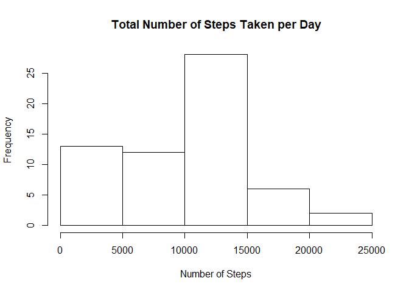
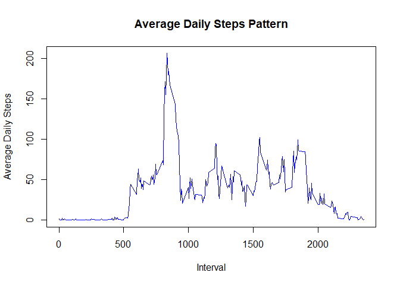
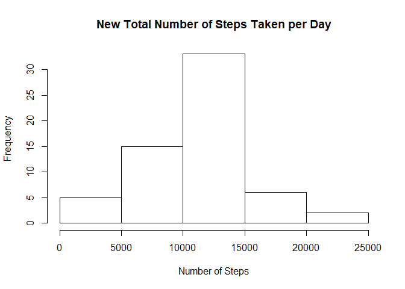
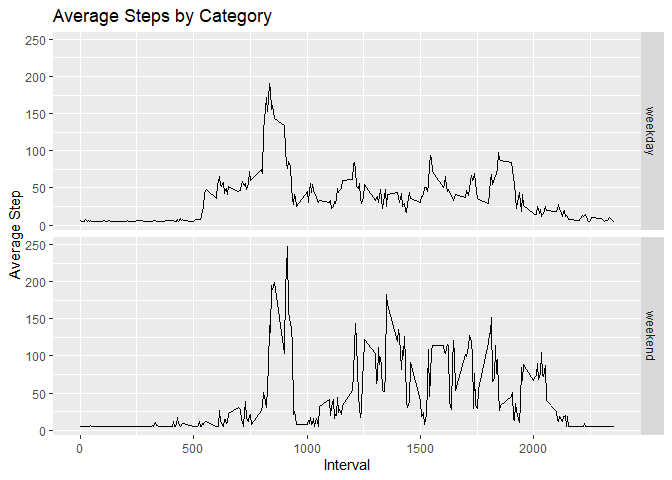

### Introduction

It is now possible to collect a large amount of data about personal movement using activity monitoring devices such as a [Fitbit](https://www.fitbit.com/home), [Nike Fuelband](https://www.nike.com/help/a/why-cant-i-sync), or [Jawbone Up](https://www.jawbone.com/up). These type of devices are part of the “quantified self” movement – a group of enthusiasts who take measurements about themselves regularly to improve their health, to find patterns in their behavior, or because they are tech geeks. But these data remain under-utilized both because the raw data are hard to obtain and there is a lack of statistical methods and software for processing and interpreting the data.

This assignment makes use of data from a personal activity monitoring device. 
This device collects data at 5 minute intervals through out the day. The data consists of two months of data from an anonymous individual collected during the months of October and November, 2012 and include the number of steps taken in 5 minute intervals each day.

The data for this assignment can be downloaded from the course web site:

Dataset: [Activity monitoring data[52K]](https://d396qusza40orc.cloudfront.net/repdata%2Fdata%2Factivity.zip)  

The variables included in this dataset are:

- **steps**: Number of steps taking in a 5-minute interval (missing values are coded as \color{red}{\verb|NA|}NA)  
- **date**: The date on which the measurement was taken in YYYY-MM-DD format  
- **interval**: Identifier for the 5-minute interval in which measurement was taken

The dataset is stored in a comma-separated-value (CSV) file and there are a total of 17,568 observations in this dataset.


### Loading and preprocessing the data

load the data

```r
actDat<-read.csv("activity.csv")
```

```
##   steps       date interval
## 1    NA 2012-10-01        0
## 2    NA 2012-10-01        5
## 3    NA 2012-10-01       10
```
append days colums, format date, and remove missing values

```r
actDat$day <- weekdays(as.Date(actDat$date))
actDat$date<-as.POSIXct(actDat$date,format="%Y-%m-%d")
#actDat<-actDat[!is.na(actDat$steps),]
```

```
##   steps       date interval    day
## 1    NA 2012-10-01        0 Monday
## 2    NA 2012-10-01        5 Monday
## 3    NA 2012-10-01       10 Monday
```


### What is mean total number of steps taken per day?

```r
total_step_day<-actDat%>% dplyr::group_by(date)%>% summarize(total_step_day=sum(steps,na.rm = T))
#totstep<-aggregate(actDat$steps~actDat$date,FUN = sum) # alternaive code
head(total_step_day)
```

```
## # A tibble: 6 x 2
##   date                total_step_day
##   <dttm>                       <int>
## 1 2012-10-01 00:00:00              0
## 2 2012-10-02 00:00:00            126
## 3 2012-10-03 00:00:00          11352
## 4 2012-10-04 00:00:00          12116
## 5 2012-10-05 00:00:00          13294
## 6 2012-10-06 00:00:00          15420
```
plot the histogram

```r
#hist(width=total_step_day$day,height=total_step_day$total_step_day)
hist(total_step_day$total_step_day,main = "Total Number of Steps Taken per Day",xlab = "Number of Steps")
```

<!-- -->

calculate average step taken per day

```r
mean(total_step_day$total_step_day)
```

```
## [1] 9354.23
```

calculate the median of dailystep 

```r
median(total_step_day$total_step_day)
```

```
## [1] 10395
```


### What is the average daily activity pattern?
group the data interval and take the average of steps


```r
ave_step_int<-actDat%>% dplyr::group_by(interval)%>% summarize(ave_steps=mean(steps,na.rm = T))
```
plot the data

```r
plot(x=ave_step_int$interval,y=ave_step_int$ave_steps,xlab = "Interval",ylab = "Average Daily Steps", main = "Average Daily Steps Pattern",type = "l",col="blue",lwd=1)
```

<!-- -->

Interval with max number of steps

```r
ave_step_int$interval[which(ave_step_int$ave_steps==max(ave_step_int$ave_steps))]
```

```
## [1] 835
```


### Imputing missing values
calculate total number of missing values i.e NA

```r
sum(!complete.cases(actDat))
```

```
## [1] 2304
```

Fill in missing values using daily averages

```r
fillmissing<-function(Dat){
  ## group data by days and return average steps by days of the week
  grpstep<-Dat%>%group_by(day)%>%summarize(stepave=mean(steps,na.rm = T))
  ## assign new variable to step and fill in missing values using weekdays average
  FilledStep<-Dat$steps
  for (jj in seq(grpstep$day)){
    kk<-which(is.na(Dat$steps) & Dat$day==grpstep$day[jj])
    FilledStep[kk]<-grpstep$stepave[jj]
  }
  return(FilledStep)
}
```


Create new dataset that is equal to original dataset with missing values filled


```r
Newdat<-actDat
Newdat$steps<-fillmissing(actDat)
head(Newdat)
```

```
##      steps       date interval    day
## 1 34.63492 2012-10-01        0 Monday
## 2 34.63492 2012-10-01        5 Monday
## 3 34.63492 2012-10-01       10 Monday
## 4 34.63492 2012-10-01       15 Monday
## 5 34.63492 2012-10-01       20 Monday
## 6 34.63492 2012-10-01       25 Monday
```

```r
sum(is.na(Newdat$steps))
```

```
## [1] 0
```

Make histogram of new data

```r
NewAve<-Newdat%>% dplyr::group_by(date)%>% summarize(newtotal=sum(steps,na.rm = T))
hist(NewAve$newtotal,main = "New Total Number of Steps Taken per Day",xlab = "Number of Steps")
```

<!-- -->

calculate new average step taken per day

```r
mean(NewAve$newtotal)
```

```
## [1] 10821.21
```

calculate the new median of daily steps 

```r
median(NewAve$newtotal)
```

```
## [1] 11015
```
The reported mean and median values for the cases of filled  
and unfilled data are slightly different.  
consequently, the histograms have different grid counts in  
the grids where the missing values are filled.  

The impact of filling missing values of a data can cause a shift  
in their first moments, i.e, mean and median values


### Are there differences in activity patterns between weekdays and weekends?

Create a new factor variable indicating whether days are weekends or weekdays

```r
Newdat$weekclass<-ifelse(Newdat$day %in% c("Saturday","sunday"),"weekend","weekday" )
Newdat$weekclass<-as.factor(Newdat$weekclass)
str(Newdat)
```

```
## 'data.frame':	17568 obs. of  5 variables:
##  $ steps    : num  34.6 34.6 34.6 34.6 34.6 ...
##  $ date     : POSIXct, format: "2012-10-01" "2012-10-01" ...
##  $ interval : int  0 5 10 15 20 25 30 35 40 45 ...
##  $ day      : chr  "Monday" "Monday" "Monday" "Monday" ...
##  $ weekclass: Factor w/ 2 levels "weekday","weekend": 1 1 1 1 1 1 1 1 1 1 ...
```

```r
head(Newdat,n=4L)
```

```
##      steps       date interval    day weekclass
## 1 34.63492 2012-10-01        0 Monday   weekday
## 2 34.63492 2012-10-01        5 Monday   weekday
## 3 34.63492 2012-10-01       10 Monday   weekday
## 4 34.63492 2012-10-01       15 Monday   weekday
```


Create a plo discriminating Newdat in terms of weekday and weekend

```r
wdat<-Newdat%>% group_by(interval,weekclass)%>% summarize(mstep=mean(steps,na.rm = T))
qplot(data=wdat,x=interval,y=mstep,facets =weekclass~.,geom = "line",
      xlab = "Interval",ylab = "Average Step",main = "Average Steps by Category")
```

<!-- -->

